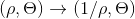
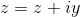
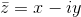
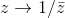

# Inversion

Section 9.1.7 of the famous [Grammar of Graphics](https://www.amazon.com/Grammar-Graphics-Statistics-Computing/dp/0387245448) 
by [Leland Wilkinson](https://en.wikipedia.org/wiki/Leland_Wilkinson) describes how to use 'Complex inversion' to turn the plane inside out.

In polar coordinates, the transform looks like this:

The complex conjugate of  is given by .  We use the complex conjugate to transform the complex plane
like this:  

This can be a neat trick to expose detail hidden near the centre of a polar plot - or we can just use it to mangle photos beyond all recognition!

[Code in the notebook](Complex Inversion.ipynb). Have fun!
